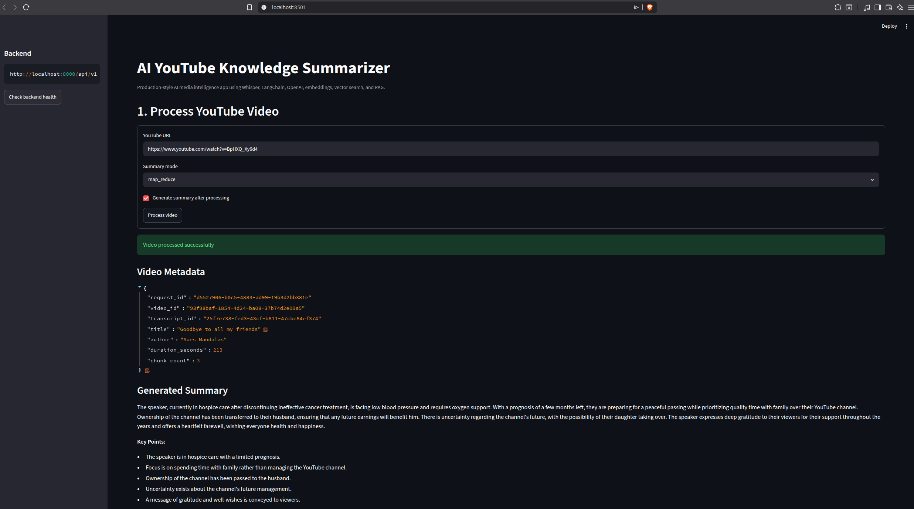
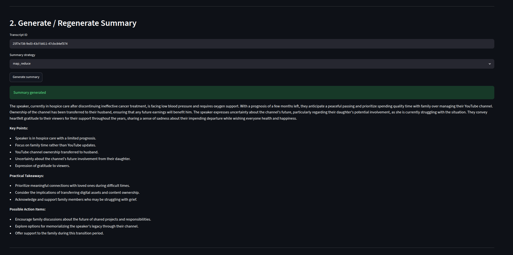
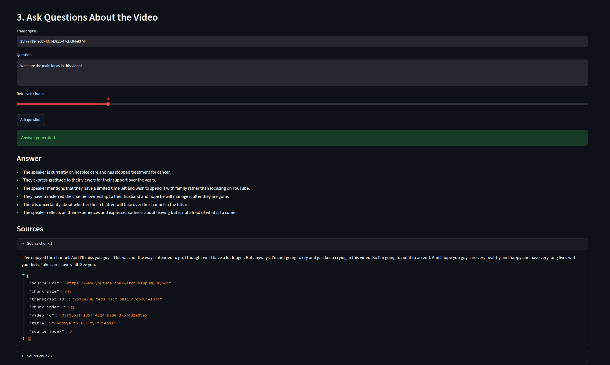

# AI YouTube Knowledge Summarizer


Production-style AI SaaS application for:
- YouTube media ingestion
- Whisper transcription
- Retrieval-Augmented Generation (RAG)
- Semantic vector search
- OpenAI summarization
- Context-aware question answering

Built with:
- FastAPI
- Streamlit
- LangChain
- OpenAI
- Whisper
- ChromaDB
- Docker

---

## Application Screenshots

### Video Processing Pipeline



### Generated Summary



### Retrieval QA with Sources



---

# Features

## AI Pipeline
- YouTube video ingestion
- Whisper transcription
- Recursive transcript chunking
- OpenAI embeddings
- Vector similarity search
- Retrieval-Augmented Generation (RAG)
- Semantic question answering
- Multiple summarization strategies

## Backend Engineering
- Production-style architecture
- Typed configuration
- Structured logging
- Typed exception hierarchy
- Service-oriented design
- Startup validation
- Operational observability
- Request correlation IDs
- Runtime validation
- Dockerized deployment

## Frontend
- Streamlit interactive UI
- Video processing workflow
- Summary generation
- Retrieval QA interface
- Source chunk visualization

---

# System Architecture

```text
                Streamlit UI
                      │
                      ▼
                 FastAPI API
                      │
        ┌─────────────┼─────────────┐
        ▼             ▼             ▼
  YouTube Loader   Whisper ASR   OpenAI LLM
        │             │             │
        └─────────────┼─────────────┘
                      ▼
               Transcript Chunking
                      ▼
               OpenAI Embeddings
                      ▼
                 Chroma Vector DB
                      ▼
                 Retrieval QA
```

Detailed architecture:

```text
docs/architecture.md
```

---

# Technology Stack

| Layer | Technology |
|---|---|
| Backend API | FastAPI |
| Frontend | Streamlit |
| AI Framework | LangChain |
| LLM | OpenAI GPT |
| ASR | Whisper |
| Embeddings | OpenAI Embeddings |
| Vector DB | Chroma |
| Validation | Pydantic v2 |
| Logging | python-json-logger |
| Testing | pytest |
| Containerization | Docker |

---

# Project Structure

```text
ai_youtube_knowledge_summarizer/
│
├── api/
├── core/
├── models/
├── services/
├── ui/
├── tests/
├── docs/
├── scripts/
│
├── main.py
├── pyproject.toml
├── Dockerfile
├── docker-compose.yml
├── Makefile
└── README.md
```

---

# Installation

## 1. Clone Repository

```bash
git clone https://github.com/w-e-ll/ai-youtube-knowledge-summarizer.git

cd ai-youtube-knowledge-summarizer
```

---

## 2. Create Virtual Environment

```bash
python3.12 -m venv venv

source venv/bin/activate
```

Windows:

```bash
venv\Scripts\activate
```

---

## 3. Install Dependencies

```bash
pip install --upgrade pip setuptools wheel

pip install -e .
```

Development:

```bash
pip install -e ".[dev]"
```

---

# OpenAI API Key

Create OpenAI API key:

https://platform.openai.com

Then create:

```text
.env
```

Example:

```env
OPENAI_API_KEY=your_openai_api_key_here

APP_NAME=AI YouTube Knowledge Summarizer
ENVIRONMENT=local
DEBUG=true

API_HOST=0.0.0.0
API_PORT=8000

OPENAI_CHAT_MODEL=gpt-4o-mini
OPENAI_EMBEDDING_MODEL=text-embedding-3-small

WHISPER_MODEL=base
WHISPER_DEVICE=cpu

VECTOR_STORE_PROVIDER=chroma

CHUNK_SIZE=1000
CHUNK_OVERLAP=100

RETRIEVER_TOP_K=4

LOG_LEVEL=INFO
LOG_TO_STDOUT=true
LOG_TO_FILE=true
```

---

# Running Application

## Run FastAPI Backend

```bash
make run-api
```

API:

```text
http://localhost:8000
```

Swagger:

```text
http://localhost:8000/docs
```

---

## Run Streamlit UI

```bash
make run-ui
```

UI:

```text
http://localhost:8501
```

---

# Docker Deployment

## Build Containers

```bash
make docker-build
```

---

## Start Services

```bash
make docker-up
```

---

## Stop Services

```bash
make docker-down
```

---

# Local AI Pipeline

Run complete AI workflow locally:

```bash
python scripts/run_local_pipeline.py \
  --url "https://www.youtube.com/watch?v=dQw4w9WgXcQ" \
  --summary-mode map_reduce \
  --question "What is the main topic of the video?"
```

---

# API Endpoints

## Health

```http
GET /api/v1/health
```

---

## Process Video

```http
POST /api/v1/videos/process
```

Request:

```json
{
  "youtube_url": "https://www.youtube.com/watch?v=example",
  "generate_summary": true,
  "summary_mode": "map_reduce"
}
```

---

## Generate Summary

```http
POST /api/v1/summaries
```

Request:

```json
{
  "transcript_id": "transcript-123",
  "mode": "map_reduce"
}
```

---

## Retrieval QA

```http
POST /api/v1/qa
```

Request:

```json
{
  "transcript_id": "transcript-123",
  "question": "What are the key ideas?",
  "top_k": 4
}
```

---

# Reliability Features

## Production-Oriented Engineering
- Typed configuration
- Environment validation
- Startup validation
- Structured logging
- Typed exception hierarchy
- Runtime validation
- Failure-safe architecture

## Observability
- Request correlation IDs
- Operational logs
- Service-level visibility
- Failure tracing
- Duration tracking

## AI Reliability
- Hallucination-resistant prompts
- Context-only retrieval QA
- Source attribution
- Safe transcript persistence
- Configurable chunking

---

# Testing

Run tests:

```bash
make test
```

Run specific test file:

```bash
pytest tests/test_vector_store.py -vv
```

---

# Code Quality

## Format

```bash
make format
```

---

## Lint

```bash
make lint
```

---

# Future Improvements

Planned:
- Async background processing
- Redis + Celery
- PostgreSQL persistence
- Multi-user authentication
- SaaS billing
- Kubernetes deployment
- Prometheus + Grafana
- OpenTelemetry tracing
- Multi-provider LLM support
- Local LLM inference
- Agentic workflows

---

# Engineering Focus

This repository demonstrates:
- AI infrastructure engineering
- RAG systems
- Vector search architecture
- Production backend engineering
- Modern Python architecture
- Observability patterns
- AI SaaS system design
- Reliable AI service integration

---

# Author

Valentin Sheboldaev

Senior Backend / AI Engineer

Core areas:
- Python backend engineering
- AI infrastructure
- Generative AI
- Retrieval-Augmented Generation
- Distributed systems
- Cloud-native backend systems

LinkedIn:

```text
https://www.linkedin.com/in/w-e-ll/
```

GitHub:

```text
https://github.com/w-e-ll
```

---

# License

MIT License
